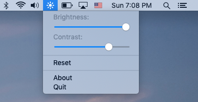

# NativeDisplayBrightness

This is a fork of [https://github.com/Bensge/NativeDisplayBrightness](https://github.com/Bensge/NativeDisplayBrightness) by Benno Krauss.

*Control your desktop monitor brightness just like on a MacBook!*

This is a utility application to control monitor brightness with the increase brightness key <kbd>🔆/F1</kbd> and decrease brightness <kbd>🔅/F2</kbd> keys on an Apple keyboard. It utilizes DDC/CI, but this app doesn't have the freezing issues that similar aplications tend to suffer from.

This app also shows the **native** system UI when changing brightness! It uses the private `BezelServices` framework for this.

Needless to say, your monitor needs to support DDC/CI for this app to work.

When holding the Shift key the increase/decrease brightness keys will cause the monitor contrast to increase or decrease.

Click on the application's menu bar icon to show a menu where the brightness and contrast may also be adjusted via sliders.

## License

This application uses code borrowed from [ddcctl](https://github.com/kfix/ddcctl) which uses code from [DDC-CI-Tools](https://github.com/jontaylor/DDC-CI-Tools-for-OS-X)

This application also uses [DDHotKey](https://github.com/davedelong/DDHotKey) by Dave DeLong to detect increase/decrease brightness key events. 

GNU GENERAL PUBLIC LICENSE
